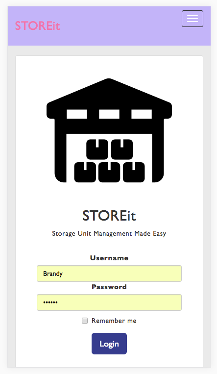

# STOREIT_INTERFACE

StoreIt is a mobile first app ready to assist with the tedious task of organizing your items in storage.  StoreIt assists in tracking number of boxes, items in boxes, value of items, and location of boxes in your storage facility.  Making it easy to locate any item any time in your storage facility.  It also allows an easy way to keep track of value of items stored in case of a break in and insurance claim.  

# DEMO

- Login: Brandy
- Password: brandy
- DEMO: "https://www.dropbox.com/s/xzvpwjb8wbgvg95/STOREitDEMO.mov?dl=0";

# Live Site

- Login: Brandy
- Password: brandy
- LINK: "https://storeitmanager.herokuapp.com/"

## Technologies Used

- React.js
- ES6/JSX
- React Bootstrap

## API's Used

- STOREIT_API_URL= "https://storeitmanager.herokuapp.com/";

## Future Development

- RFD scanner
- Value look up
